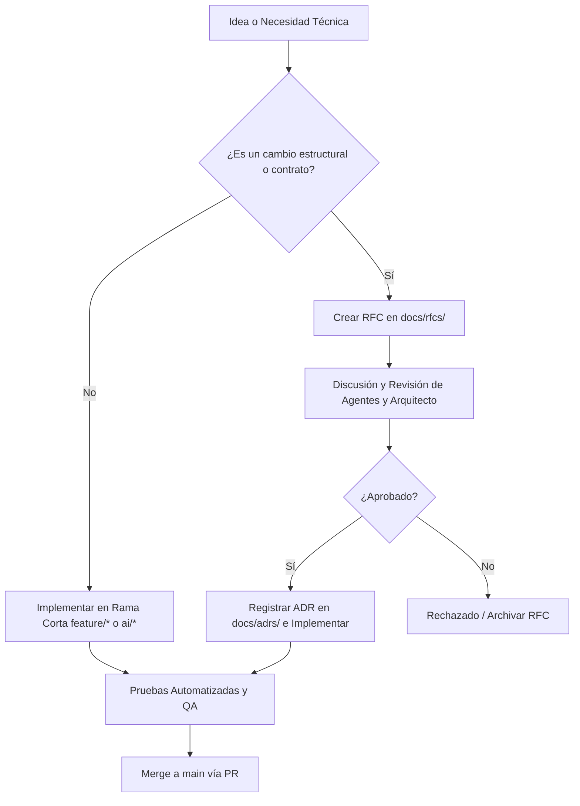

# STUDIO.md — ESTRUCTURA Y GOBERNANZA DEL ESTUDIO

## 🏢 Visión del Estudio

Somos un estudio de desarrollo de videojuegos **AI-Native**, estructurado desde el primer día para potenciar la simbiosis entre ingenieros humanos y agentes autónomos de inteligencia artificial.

La organización del estudio no se basa en jerarquías corporativas tradicionales, sino en una **red de agentes de rol especializado** supervisados por liderazgo arquitectónico humano.

---

## 👥 Modelo de Gobernanza Híbrida

### 1. El Chief Software Architect (Liderazgo Humano / IA)
- **Responsabilidad**: Define la visión de ingeniería, aprueba RFCs, resuelve conflictos entre agentes y custodia la [CONSTITUTION.md](file:///E:/GRAVITY/CONSTITUTION.md).
- **Autoridad**: Veto absoluto sobre cualquier Pull Request o propuesta que degrade la integridad del Workspace.

### 2. Agentes de IA Especializados (AI Domain Agents)
El estudio asigna roles bien delimitados a los asistentes de IA. Cada rol opera bajo un documento de fronteras en `docs/agents/`:
- **`ARCHITECT`**: Mantiene la coherencia de diseño y ADRs.
- **`NETWORK_ENGINEER`**: Diseña e implementa la topología y predicción en red.
- **`GAMEPLAY_PROGRAMMER`**: Desarrolla componentes modulares de entidad.
- **`DATA_ENGINEER`**: Mantiene los schemas de datos, serialización y balance.
- **`QA_AUTOMATION_ENGINEER`**: Escribe y ejecuta suites de pruebas continuas.
- **`ASSET_PIPELINE_ENGINEER`**: Automatiza e inspecciona el ingreso de assets binarios.
- **`SECURITY_AUDITOR`**: Audita la seguridad del servidor autoritativo y netcode.

---

## 🔄 Ciclo de Vida de las Decisiones (Workflows)

---

## 🛡️ Escalado e Integración Continua

1. **Sin dependencia de héroes individuales**: Cualquier desarrollador o agente puede asumir una tarea consultando `docs/specs/` y `docs/agents/`.
2. **Memoria Institucional**: Los errores del pasado se convierten en reglas en `memory/lessons_learned.md`.
